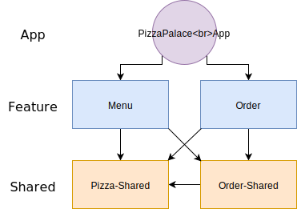

# @ngxp/pizza-palace

An example Angular application that uses [Nx Workspace](https://nx.dev) and [Ngrx](https://ngrx.io) to show how to build modularized frontends in a monorepo.




## Modularization
This section describes the technical foundation of the artefacts described in the architecture overview.

### Repositories and Workspaces
The repositories for applications and libraries should reflect the organizational boundaries of the teams implementing them. Following the idea that each microservice has its own dedicated team this means that all feature libraries of a microservice should be managed within the repository of that microservice. The same applies to shared libaries and the applications which all have their dedicated repository.

Each repository contains a workspace created with [Angular CLI](https://cli.angular.io/) and [Nx Workspace](https://nrwl.io/nx).

### Application Workspace
Applications are kept modularized by separating features out into dedicated modules via Nx' `ng generate lib` command. The root app module should be as lean as possible and mostly contain code for configuring and setting up the application as well as orchestrating the feature modules.

The following examples illustrates the module structure for the simple pizza palace online shop application.

```
project root
├─ apps
│  └─ pizza-palace
├─ libs
│  ├─ menu
│  ├─ order
│  ├─ order-shared
│  └─ pizza-shared
```

The `pizza-palace` app module provides the application frame including basic UI and configuration and otherwise delegates to lazy-loaded feature modules for implementing the actual features of the app.

#### App Module
The app module is the entry-point for Angular's bootstrapper and configures application-wide modules. Via the routing configuration, the app module defines which feature modules are loaded while the user navigates through the application.

```ts
// app.module.ts
@NgModule({
…
    imports: [
        RouterModule.forRoot([
            { path: '', pathMatch: 'full', redirectTo: 'menu' },
            { path: 'menu', loadChildren: () => import('@pizza-palace/menu').then(m => m.MenuModule) },
            { path: 'order', loadChildren: () => import('@pizza-palace/order').then(m => m.OrderModule) }
        ])
    ]
…
})
export class AppModule { }
```

The root component of the application defines the basic shell of the application and otherwise delegates to the components wired up via the routing configuration.

```html
<!-- app.component.html -->
<div class="container">
    <router-outlet></router-outlet>
</div>
```

#### Feature Modules
Feature modules expose their API through a file called `index.ts` within the `src` directory. Other modules may only import what is exposed through this file.

```
project root
├─ libs
│  ├─ menu
│  │  ├─ src
│  │  │  ├─ lib
│  │  │  │  ├─ menu
│  │  │  │  │  └─ menu.component.ts
│  │  │  │  └─ menu.module.ts
│  │  │  └─ index.ts
```

The menu feature module for example only exports the `MenuModule` that is used in the `AppModule`'s routing configuration. The `MenuComponent` is not directly referenceable by other modules.

```ts
// index.ts
export * from './lib/menu.module';
```

#### Shared Modules

As the name suggests, lazy-loaded feature modules are only loaded when the user navigates to the route for which the module is configured. That's why it is recommended to place features, that are used by other modules, into separate modules.^

In the following example, the `menu` feature module uses the `current-order` component. If that component was put in the `order` feature module, the whole module would be loaded when rendering the `menu` component even if the user never navigates to a view of the `order` feature module.

```html
<!-- menu.component.html -->
<div class="row justify-content-between align-items-center m-0 my-4">
    <h1 class="m-0">Menu</h1>
    <pp-current-order></pp-current-order>
</div>
```

Instead, the component is provided by the `order-shared` module...

```
project root
├─ libs
│  ├─ order-shared
│  │  ├─ src
│  │  │  ├─ lib
│  │  │  │  ├─ current-order
│  │  │  │  │  └─ current-order.component.ts
│  │  │  │  └─ order-shared.module.ts
│  │  │  └─ index.ts
```

```ts
// index.ts
export * from './lib/order-shared.module';

```

```ts
// order-shared.module.ts
@NgModule({
…
    declarations: [
        CurrentOrderComponent
    ],
    exports: [
        CurrentOrderComponent
    ]
…
})
export class OrderSharedModule {}
```

.. which is imported in the `menu` module's configuration.

```ts
// menu.module.ts
import { OrderSharedModule } from '@pizza-palace/order-shared';

@NgModule({
    …
    imports: [
        OrderSharedModule
    ]
…
})
export class MenuModule { }
```

#### Importing Feature/Shared Modules
When importing feature or shared modules instead of using a relative path, a package name is used.

```ts
// menu.module.ts
import { OrderSharedModule } from '@pizza-palace/order-shared';
```

This is done using the `paths` compiler option of TypeScript. The global `tsconfig.json` contains a mapping between package names and local paths. Mappings are automatically added when generating a new libary via Nx.

```json
// tsconfig.js
{
…
  "compilerOptions": {
    "paths": {
      "@pizza-palace/order-shared": [
        "libs/order-shared/src/index.ts"
      ]
    }
  }
…
}

```

This means that libraries that were developed within an application workspace can evolve into shared libraries that are used across multiple applications in the future.
